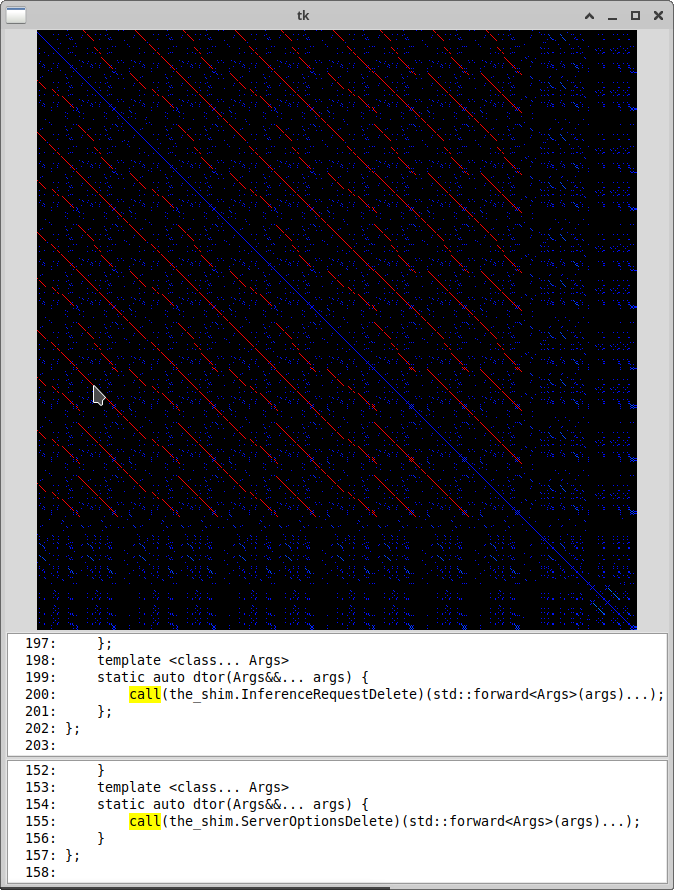
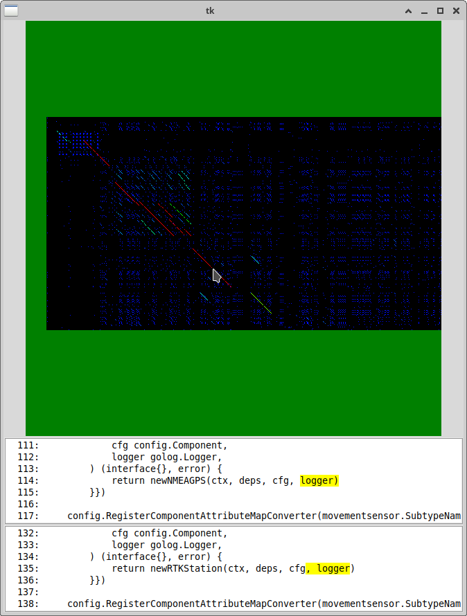
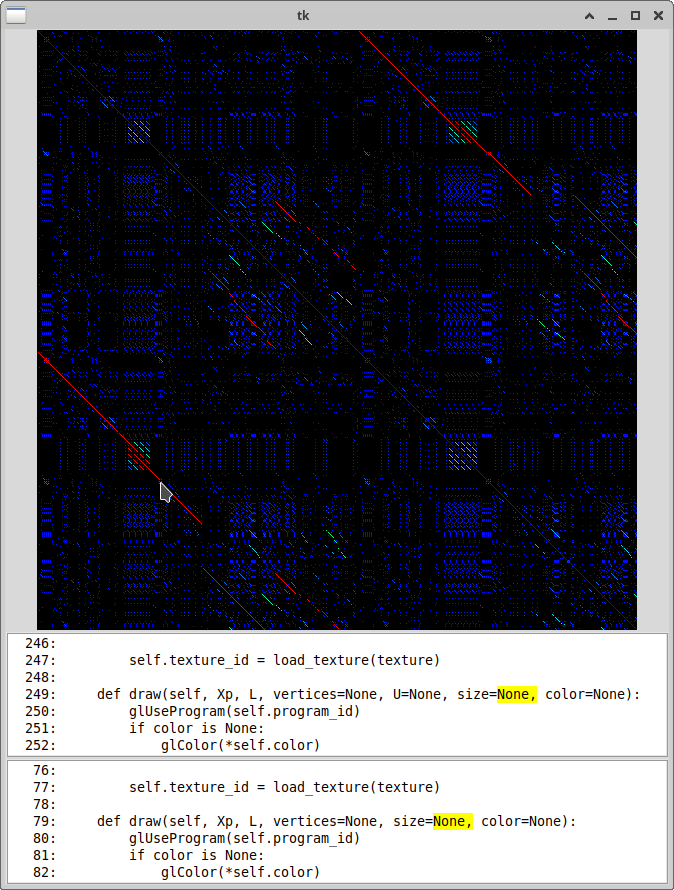
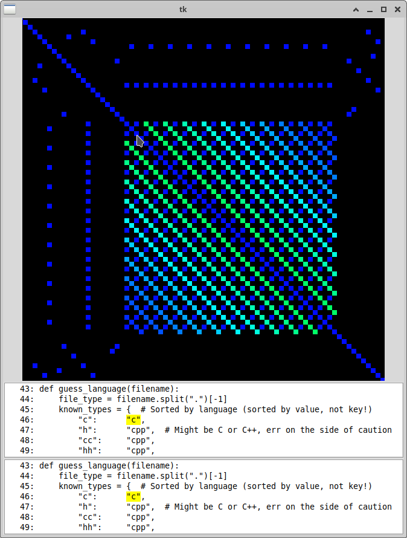

# visual_diff
A tool for generating a visual comparison of two files of source code.

The main program is `visual_diff.py`. You can either specify 1 or 2 different
filenames containing source code as arguments to it. With 2 files, it compares
one to the other; with only 1 file it compares the file to itself.

Each file is treated as a sequence of lexical tokens. A token is the smallest
semantic piece of a program; tokens include keywords like "if" and "for",
parentheses, variable names, etc. We then generate an image, in which the pixel
in row i and column j is set if the ith token from the first file and the jth
token from the second file are equal. All string literals are considered equal
regardless of their contents; all literal numbers are considered equal, too.

When you run the program, a graphical user interface will open up in which you
can explore the image. Use the scroll wheel to zoom in and out, click-and-drag
to pan around, and mouse around the image to explore the code. Quit with
control-Q or control-W. The intention is for the GUI to be very similar to
Google Maps, OpenStreetMap, or other map exploration interfaces.

Below the map are two snippets of code, indicating which token(s) your mouse is
currently pointing to. The top snippet indicates the code for the row that your
mouse is on, and the bottom snippit is for the column. In large images, as you
zoom out, multiple tokens will be combined into single pixels in the image, and
multiple tokens will be highlighted in these snippets.

## Prerequisites
You'll need [Tcl/Tk bindings](https://docs.python.org/3/library/tkinter.html)
for Python. This might require installing something outside of your virtual
environment: you'll know it's set up right if you can run `python3 -m tkinter`
and get a little interactive window to pop up.

- On Mac: `brew install python-tk`
- On Ubuntu: `sudo apt-get install python3-pil.imagetk`

After that, just `pip3 install -r requirements.txt`, and you should be good!

If you get errors about not doing this in a virtual environment, try
`python3 -m venv venv`, then `source venv/bin/activate`, and _then_
`pip3 install -r requirements.txt`.

If you're running a different OS, good luck (and if you get it to work, please
either file an issue telling us to update the documentation with what you did,
or update it yourself and send us a pull request!).

## Options
The short version: run `visual_diff.py --help` for info.

The program can recognize a handful of languages from the file extension (e.g.,
`.py` or `.go`). If you want to use a language that is not automatically
recognized, you can do so with the `--language` flag. We use
[`tree_sitter`](https://tree-sitter.github.io/tree-sitter/) for tokenizing,
and it supports [many dozens of
languages](https://github.com/tree-sitter/tree-sitter/wiki/List-of-parsers).
Both files must be written in the same language (though I have vague plans to
change that in the future!). If manually setting the language is a common
annoyance for you, please send us a PR with your file extension and language!
The place to change is in `utils.py`, in the `guess_language()` function.

By default, the program will attempt to color the pixels of matching tokens:
blue pixels are probably noise (e.g., two periods that have no other matching
tokens nearby), whereas red pixels are definitely duplicated code. Sequences of
pixels get their colors by joining together chains of matching pixels near each
other. When comparing a single file to itself, the main diagonal is artificially
suppressed to blue, because of course each token is equal to itself.

The coloring algorithm can be both memory- and time-intensive. For images larger
than 50 megapixels (roughly 1300 lines of code in each file), we exit with
warnings, rather than risk having your computer freeze when it runs out of
memory. To work around this, you can use the `--black_and_white` option to skip
coloring, or the `--big_file` option to color anyway (but use the latter at your
own peril!).

If you specify an `--output_location`, then instead of opening the GUI, the
image will be saved to file and then the program will exit. Most popular image
formats should work, including `.png`, `.gif`, `.jpg`, and `.bmp`.

Saving images to a file takes much more memory than displaying them to the
screen (because most image formats involve compression algorithms), so doing
this with large images can again freeze your whole system. By default, we refuse
to save any image that is over 50 megapixels. This can be overridden with the
`--big_file` flag, but again **use that at your own peril.**

When using the GUI, you can set the maximum line length for the code displayed
using the `--text_width` or `-tw` option (default is 100 characters, except
Python files are 80 characters), and you can set the sidelength, in
pixels, of the GUI's (square) map view using the `--map_width` or `-mw` option
(default is 600 pixels).

## Uses
Finding code that has been copied and pasted or is otherwise similar enough to
consider refactoring. This is the main use case of this code. These show up
as diagonal lines in the image.

#### Other Uses
- Finding students who are cheating on their homework by copying and pasting
  code from each other. There are better tools for this task, but `visual_diff`
  is better than nothing.
- Cheating on homework by making sure that the code you have copied and pasted
  has been modified enough that it no longer looks copied and pasted. 🙃

## Examples

The context at the bottom highlights the token(s) represented by the pixel the
mouse is pointing to.

Boilerplate code that repeats itself a lot clearly looks like it repeats:

Here's a short file compared to a longer file which was created by copying the
short file and modifying it:

This is a single file compared to itself, where the second half of the file
was created by modifying a copy of the first half. There are also some helper
functions repeated in the first half and repeated again in the second half:

Data structures with very regular structure, such as lists and dictionaries,
show up as very regular structures:

If you zoom out in a very large file, each pixel of the map will contain
multiple tokens within it. Duplicated code will still show up as a diagonal
line even if the individual pixels only match partially. This file was large
enough that I used the `--black_and_white` flag to skip the coloring, which
saved gigabytes of memory and multiple minutes of startup time.

The mouse cursor has been artificially colored purple in order to better
distinguish it from the background.

## Motivation
This code was predominantly written by Alan Davidson. He got the
idea from a talk he saw at DEFCON 2006, in which [Dan
Kaminsky](https://dankaminsky.com/) showed a very similar tool he had built to
compare binaries made from the same source code using different compilers.
Here are [slides he made](https://www.slideshare.net/slideshow/dmk-shmoo2007/5920322#45)
for a very similar talk at SchmooCon 2007 (start around slide 45).

## Running the tests

`python -m unittest discover -p '*_test.py'`
